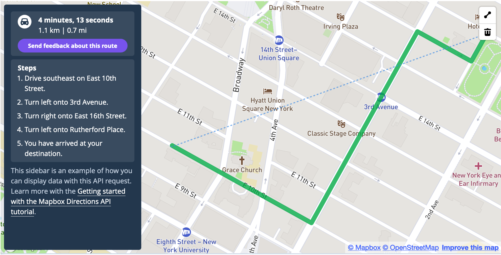

# Homework 4 — Building APIs with Flask

**This is a group assignment. You can choose your group through GitHub Classroom.**

Signup for assignment here: <https://classroom.github.com/g/rLRhBW2J>

**Due:** Nov 5th at 11:59pm ET

Build three API endpoints for the scenarios listed below. Through the GitHub Classroom group repository, submit your responses as a Python script that can run as a Flask application and function (local) API. Load all credentials from separate files (e.g., JSON files like we do in class). Make sure that both group members contribute code to the repo.

## Problems

1. Build an API endpoint to report nearby covid cases (in Philadelphia) based on an arbitrary address.
    1. Use an API call to Mapbox or [Google](https://developers.google.com/maps/documentation/geocoding/) geocoding service
    1. Use the class PostgreSQL database to get Covid tests
    1. Take user input as an API query parameter
    1. The API should return an HTML page that has:
        1. Description of user inputs and date/time of request
        1. A report on local Covid tests
        1. A static map of the area around the address with a [marker](https://docs.mapbox.com/api/maps/#marker) over the address location
        1. Styled HTML outputs so UI is easy to interpret
2. Build a "how to walk to Meyerson Hall" app
    1. Takes an arbitrary (Philadelphia) location as starting point. End point is Meyerson Hall.
    1. Use Mapbox (or Google) Directions API to generate a walking or cycling path
    1. Generate an interactive map to show the path. See demo code from Lecture ([Python templating](https://github.com/MUSA-509/week-9-apis-with-flask/blob/main/app.py#L166-L172) and [HTML template](https://github.com/MUSA-509/week-9-apis-with-flask/blob/main/templates/geojson_map.html))
    1. Print the steps of the route alongside the map similar to what happens in the [Mapbox Directions API Playground](https://docs.mapbox.com/playground/directions/):
      
3. Create an index endpoint ('/') that links to examples of the two endpoints in problems \#1 and \#2
